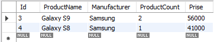

## DataBase = lesson1

USE lesson1;

# Выведите название, производителя и цену для товаров, количество которых превышает 2

SELECT Manufacturer, Prise

FROM phone

WHERE ProductCount > 2;

# Выведите весь ассортимент товаров марки “Samsung”

SELECT *

FROM phone

WHERE Manufacturer = "Samsung";

# Выведите информацию о телефонах, где суммарный чек больше 100 000 и меньше 145 000

SELECT *

FROM phone

WHERE ProductCount * Prise > 100000 and ProductCount * Prise < 145000;

